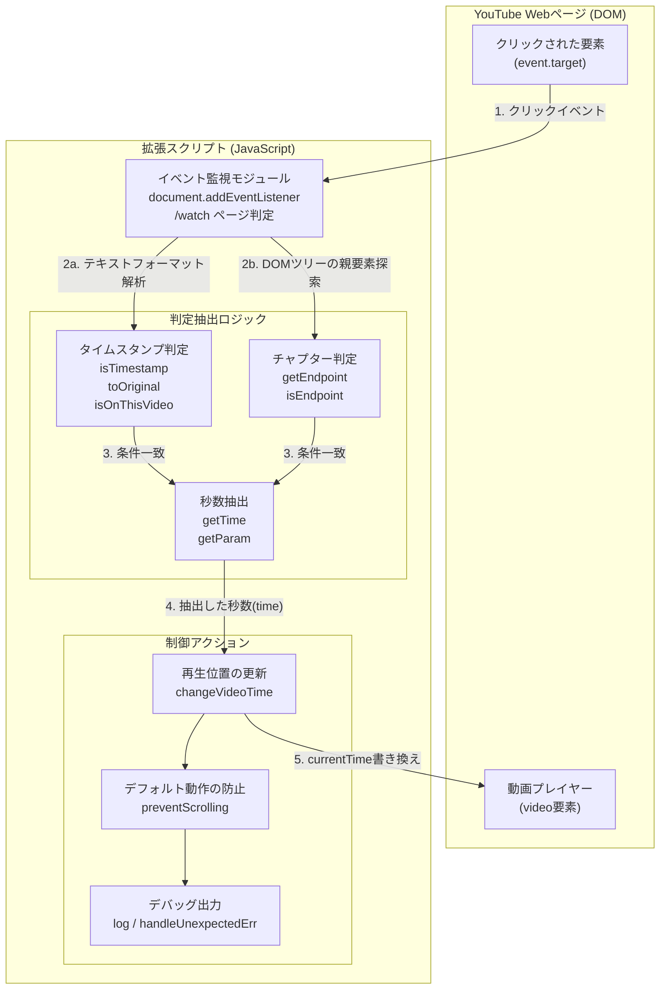

```mermaid
flowchart TB
    subgraph YouTube["YouTube Webページ (DOM)"]
        Target["クリックされた要素<br>(event.target)"]
        Video["動画プレイヤー<br>(video要素)"]
    end

    subgraph Script["拡張スクリプト (JavaScript)"]
        Listener["イベント監視モジュール<br>document.addEventListener<br>/watch ページ判定"]
        
        subgraph Logic["判定抽出ロジック"]
            direction TB
            TimestampCheck["タイムスタンプ判定<br>isTimestamp<br>toOriginal<br>isOnThisVideo"]
            ChapterCheck["チャプター判定<br>getEndpoint<br>isEndpoint"]
            GetTime["秒数抽出<br>getTime<br>getParam"]
        end
        
        subgraph Action["制御アクション"]
            direction TB
            ChangeTime["再生位置の更新<br>changeVideoTime"]
            Prevent["デフォルト動作の防止<br>preventScrolling"]
            Log["デバッグ出力<br>log / handleUnexpectedErr"]
        end
    end

    %% データフローと連携
    Target -- "1. クリックイベント" --> Listener
    
    Listener -- "2a. テキストフォーマット解析" --> TimestampCheck
    Listener -- "2b. DOMツリーの親要素探索" --> ChapterCheck
    
    TimestampCheck -- "3. 条件一致" --> GetTime
    ChapterCheck -- "3. 条件一致" --> GetTime
    
    GetTime -- "4. 抽出した秒数(time)" --> ChangeTime
    ChangeTime -- "5. currentTime書き換え" --> Video
    
    ChangeTime --> Prevent
    Prevent --> Log
```
